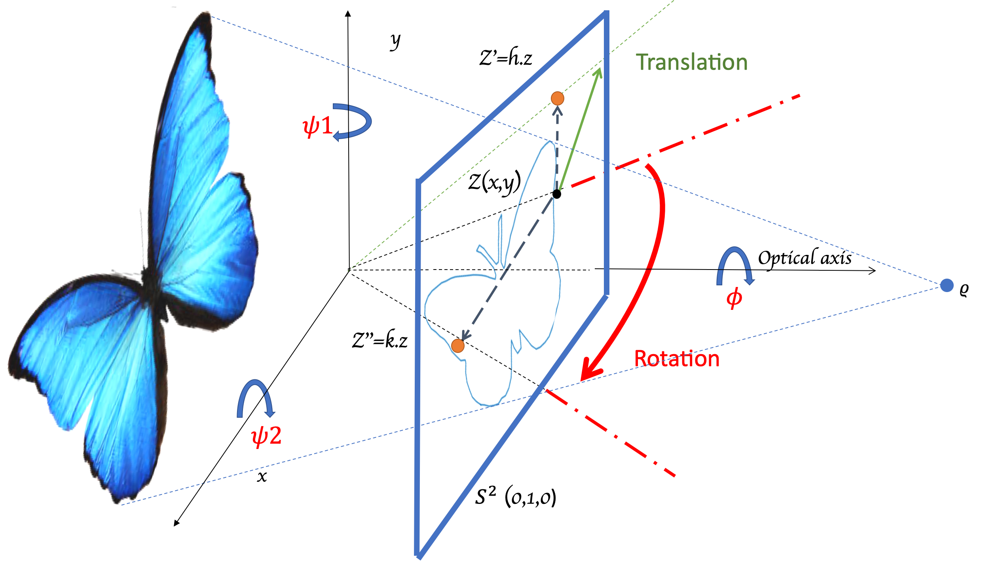

# AI3D
AI3D: Contour Abstraction for Deep Neural Network's Certification against 3D Displacement

Traditional deep-learning verification tools often deal with image-type data. Such systems certify the robustness of the image classifier against attacks including simple contrast, FGSM noise, and $L_{\infty}$. Very few studies deal with geometric certification which is still a remaining challenge. On contour-type data, the robustness of a given NN-based classifier is a critical issue. To assess it. In this work, we propose a general framework of Lower and Upper Bounds that enables us to verify the robustness of a DNN against a broader range of projective attacks represented by 3D displacement..
We implement it as a system which is the first that certifies deep contour classifiers. Additionally, we integrated this into a multimodal system that verifies images based on both pixel representations and contours. We propose to name this system AI3D. We tested it on two different image datasets, extracting their contours using an affine arclength reparametrization approach to represent contours with (X, Y) coordinates: [Contour extraction](https://github.com/ImenSmatiENSI/Multimodal_extraction).

  This figure illustrates the concept of the system, depicting various perturbations within the projective transformation, such as 3D translation or 3D rotation. 

The AI3D framework is implemented in python programming language and supports any architecture as fully connected, convolutional, and max pooling layers for contours' classification. 
Based on the DeepPoly analyzer, a domain that combines Polyhedrons with Intervals. It is implemented using two main libraries: [ERAN](https://github.com/eth-sri/eran) and [ELINA](https://github.com/eth-sri/ELINA) library, coded in respectively Python and C programming languages.

If your aim is to implement neural network verification in your application, it's advisable to employ the latest [ERAN](https://github.com/eth-sri/eran) verifier, which boasts enhanced verification algorithms rooted in abstract interpretation. To incorporate this verifier and enable contour support for any object tested with deepPoly, consult the adapted main framework. When selecting the abstract domain, consider its suitability for representing the specific attacks tested in this research.

All steps for embedding contours and preprocessing image data, including contour extraction, are detailed in the "Multimodal Extraction" repository on my GitHub. You can find the repository [here](https://github.com/ImenSmatiENSI/Multimodal-System))
